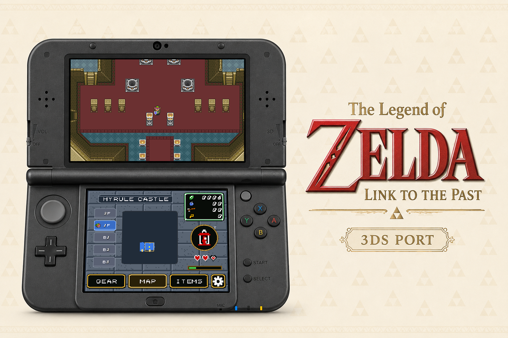

# The Legend of Zelda: A Link to the Past 3DS



Port nativo de Zelda3 para Nintendo 3DS com suporte a tela dupla, adaptado para
Old 3DS e New 3DS com ajuda do Codex.

[Read in English](README.md)

Este projeto e baseado em trabalhos open source de:

- Engine original de Zelda3 com engenharia reversa: https://github.com/snesrev/zelda3
- Base do port Android: https://github.com/Waterdish/zelda3-android
- Branch Android com tela dupla usada como base do port 3DS:
  https://github.com/samyost1/zelda3-android

Nenhuma ROM ou pacote extraido do jogo e distribuido neste repositorio. Cada
usuario precisa fornecer sua propria ROM americana, sem header, no cartao SD do
3DS.

## Estado atual

- Versao estavel atual: `v1.0`
- Repositorio: https://github.com/BC-Estrategias/zelda-alttp-3ds
- Pagina de releases: https://github.com/BC-Estrategias/zelda-alttp-3ds/releases

## Recursos no Nintendo 3DS

- Tela superior: gameplay em 400x240.
- Tela inferior: mapa ao vivo, mapa de dungeon, menu de equipamentos,
  selecao de itens e configuracoes por toque.
- Na primeira execucao, o jogo extrai `zelda3_assets.dat` localmente da ROM.
- Modos de exibicao: wide, stretched original e original aspect.
- Velocidade turbo: off, x2, x3, x4 ou x5.
- No New 3DS, segure `ZR` para turbo quando ele estiver ativado.
- Save state rapido: `L + ZL`.
- Load state rapido: `R + ZR`.
- Diagnostico rapido: `L + R + A` gera um dump com arquivos de memoria e
  capturas das duas telas.
- Apresentacao com PICA200/Citro2D nas duas telas com nearest-neighbor e
  saida RGB565.
- Gameplay em passo fixo de 60 Hz com catch-up limitado.
- Renderizacao paralela do PPU nos Core 0 e 1, e tambem no Core 2 no New 3DS.
- O banner do menu HOME usa um modelo 3D CGFX leve com som curto em PCM WAV.

## Instalacao

Baixe a build publicada na pagina de releases:

https://github.com/BC-Estrategias/zelda-alttp-3ds/releases

Cada release deve incluir:

- CIA instalavel
- 3DSX para Homebrew Launcher
- QR code para instalar pelo FBI

Depois de instalar o CIA, crie esta pasta no cartao SD:

```text
sdmc:/3ds/Zelda 3DS/
```

Coloque ali uma ROM americana valida, sem header. O nome preferencial e
`zelda3.sfc`, mas o setup tambem aceita outros arquivos `.sfc` ou `.smc`.

Na primeira execucao, pressione `A` para validar a ROM e extrair os assets. A
ROM e lida localmente e nunca e copiada para dentro do CIA.

O audio exige:

```text
sdmc:/3ds/dspfirm.cdc
```

O Luma3DS pode gerar esse arquivo a partir do proprio console pelo comando
`Dump DSP firmware` no menu Rosalina.

## Compilacao

Requisitos:

- `cmake`
- devkitARM, libctru e 3ds-cmake em `DEVKITPRO`
- `makerom` e `bannertool` para empacotar o CIA
- o SDL2 ja incluido em `app/jni/SDL2`
- `banner.cgfx` ja precompilado em `platform/3ds/assets`

Compile com:

```sh
chmod +x platform/3ds/build.sh
platform/3ds/build.sh
```

O script gera o 3DSX e o CIA em `build-3ds/game/`.

## Legal

Este repositorio contem apenas codigo-fonte, scripts de build, assets
redistribuiveis do port e a logica de patch/extracao. Ele nao inclui ROM,
assets extraidos do jogo nem `zelda3_assets.dat`.

Cada usuario e responsavel por fornecer sua propria ROM compativel obtida
legalmente.
